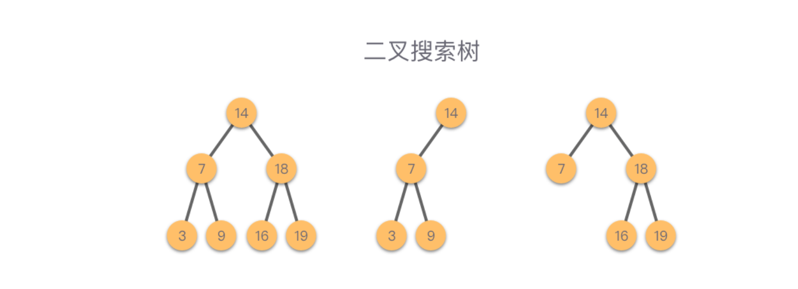

#### 二叉搜索树

性质:

1. 如果任意节点的左子树不为空,则左子树上所有节点的值均小于他的根节点的值

2. 如果任意节点的右子树不为控,则右子树上所有节点的值均大于他的根节点的值

3. 任意节点的左子树.右子树均为二叉搜索树

	



##### 二叉树的查找

1. 如果二叉树搜索树为空,则查找失败,结束查找,并返回空指针节点None

2. 如果二叉树不为空则将要查找的值val与二叉搜索树根节点的值root.val 进行比较

	1. 如果val == root.val ,则查找成功,结束查找,返回被查找到的节点

	2. 如果val < root.val,则递归查找左子树.

	3. 如果val > root.val,则递归查找右子树

		

```python
def search(root,val):
    if not root:
        return None
    if val == root.val:
        return root
    elif val<root.val:
        return search(root.left,val)
    elif val>root.val:
        return search(root.right,val)
    
```

##### 二叉搜索树的插入

1. 如果二叉搜索树为空,则创建一个值为val的节点,并将其作为二叉搜索树的跟节点

2. 如果二叉搜索树不为空,则将待插入的值val与二叉搜索树的根节点的值进行比较

	1. if val <root.val, 则递归将值为val的节点插入到左子树中

	2. if val >root.val,则递归将值为val的节点插入到右子树中

		

````python
def insert(root,val):
    if root==None:
        return TreeNode(val)
	if val<root.val:
        root.left = insert(root.left,val)
    if val >root.val:
        root.right = insert(root.right,val)
    return root

````


##### 二叉搜索树的创建

```python
def insert(root,val):
    if root = None:
        return TreeNode(val)
    if val<root.val:
        root.left = insert(root.left,val)
  	if val>root.val:
        root.right = insert(root.right,val)
    return root
def buildTree(nums):
    root = TreeNode(val)
    for num in nums:
        insert(root,nums)
	return root 
```

二叉搜索树的删除

```python
"""
删除节点的位置有三种情况
1.被删除的节点左子树为空,令右子树代替被删除节点的位置
2.被删除的节点右子树为空,则左子树代替被删除节点的位置
3.被删除的节点左右子树均不为空,则根据二叉搜索树的中序遍历有序性,删除该节点时,可以使用前去(或者直接后继)代替被删除节点的位置
.直接前驱:在中序遍历中,节点p的直接前驱为其左子树最右侧的叶子节点
.直接后继:在中序遍历中,节点p的直接后继为其右子树最左侧的叶子节点

算法步骤:
1.当前节点为空,则返回当前节点
2.如果当前节点值大于val,则递归去左子树中搜索并删除,此时root.left也要跟着递归更新
3.如果当前节点值小于val,则递归去右子树中搜索并删除,此时root.right也要跟着递归更新
4.如果当前节点值等于val,则该节点就是待删除节点.
	1.如果当前节点的左子树为空,则删除该节点之后,则右子树代替当前节点位置,返回右子树
	2.如果当前节点的右子树为空,则删除该节点之后,则左子树代替当前节点位置,返回左子树
	3.如果当前节点的左右子树都有,则将左子树转移到右子树最左侧的叶子节点位置上,然后右子树代替当前节点位置
"""
def delet(root,val):
    if not root:
        return root
    if root.val>val:
        root.left = delet(root.left,val)
        return root
    elif root.val<val:
        root.right = delet(root.right,val)
        return root
    else:
        if not root.left:
            return root.right
        elif not root.right:
            return root.left
        else:
            curr = root.right
            while curr.left:
                curr = curr.left
            curr.left = root.left
            return root.rigth
```

